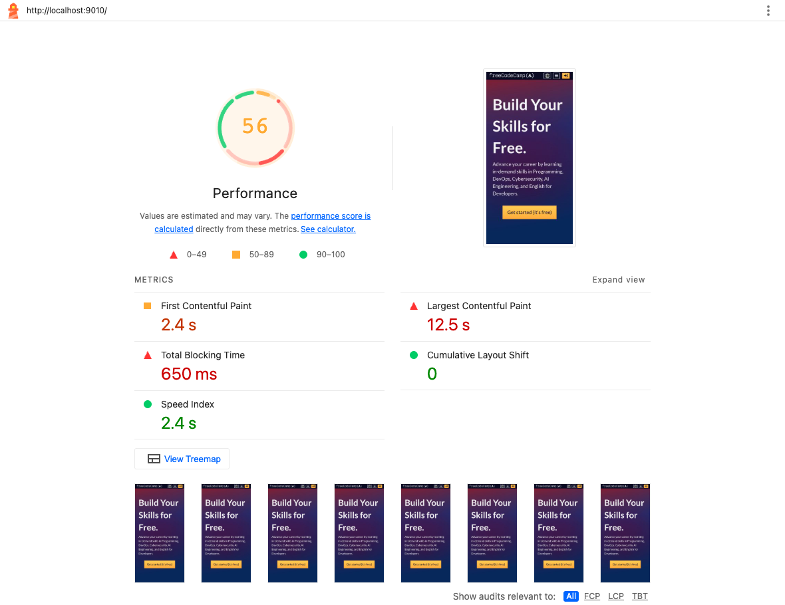
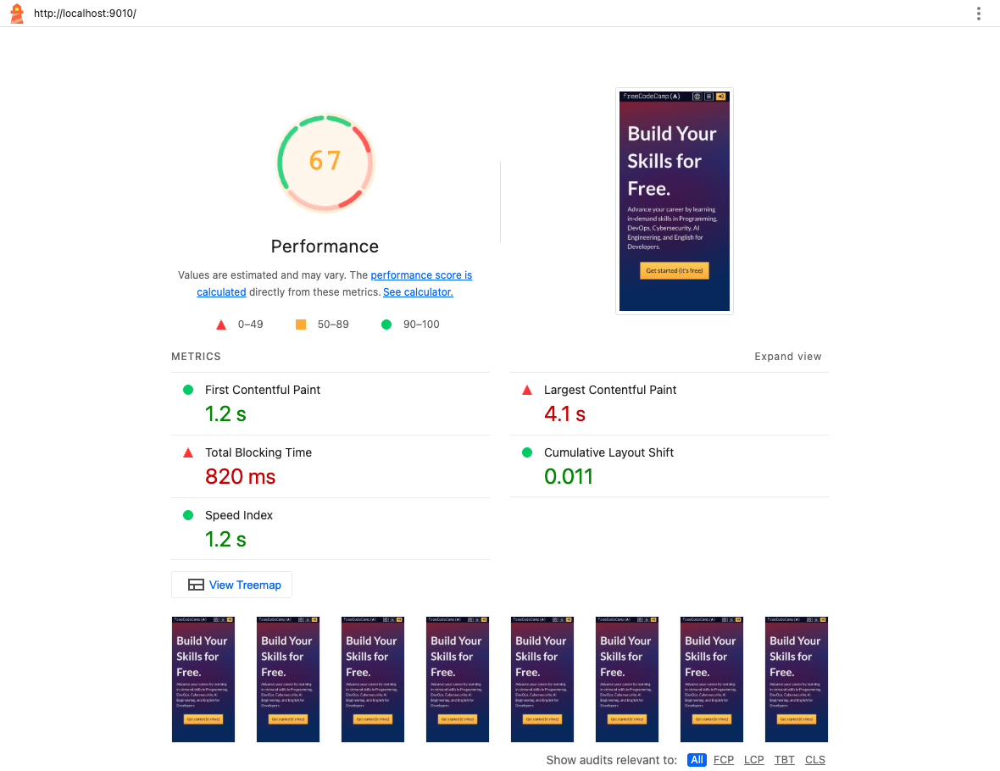

# Homepage rendering comparison

Comparison for `fix/growthbook-homepage-loading`, commit `9f4f7cfe626cf0a09a76af523a9d997da07467c4`, against upstream `675dd0621d`.

The homepage renders public content before user data and GrowthBook finish loading. The experimental CTA still waits for both. Responsive header and hero rendering use consistent initial markup to avoid hydration errors.

| Mobile Lighthouse median | Before | After |
| --- | ---: | ---: |
| Performance | 56 | 67 |
| First contentful paint | 2.40 s | 1.23 s |
| Largest contentful paint | 12.49 s | 4.13 s |
| Total blocking time | 647.5 ms | 826.0 ms |
| Cumulative layout shift | 0.000 | 0.011 |

Three alternating before/after runs of scoped local production builds, using Lighthouse 13.4.1 and Chrome 152 with default simulated mobile throttling, a fresh profile each run, and gzip at localhost:9010. Both variants use the same anonymous user response and GrowthBook fixture with the single-button CTA forced. Third-party services remain enabled under the existing local configuration. These are lab measurements, not deployed scores.

The screenshots show representative original reports with the median score, selected from the runs recorded in [summary.json](summary.json). The selected reports are `reports/before-2.html` and `reports/after-3.html`. Other metrics in the screenshots are values from those individual runs. The table above uses per-metric medians.

| Before | After |
| --- | --- |
|  |  |

Validation: nine focused component tests; four production Playwright checks covering initial HTML and hydration at desktop/mobile widths; four browser cases checking both CTA variants; TypeScript, ESLint, Stylelint, and formatting checks. The new no-JavaScript regression test fails on the original build and passes with the fix.

The audit includes the homepage, /learn, a classic HTML challenge, 404 pages and generated superblock introductions. Unrelated routes were excluded from HTML generation to fit local resources. Source maps and persistent webpack caching were disabled equally for both builds. A full curriculum build was not run locally. Neither the parked font changes nor the separate search chunk fix are included. Raw reports and build logs are retained in the local comparison directory.
